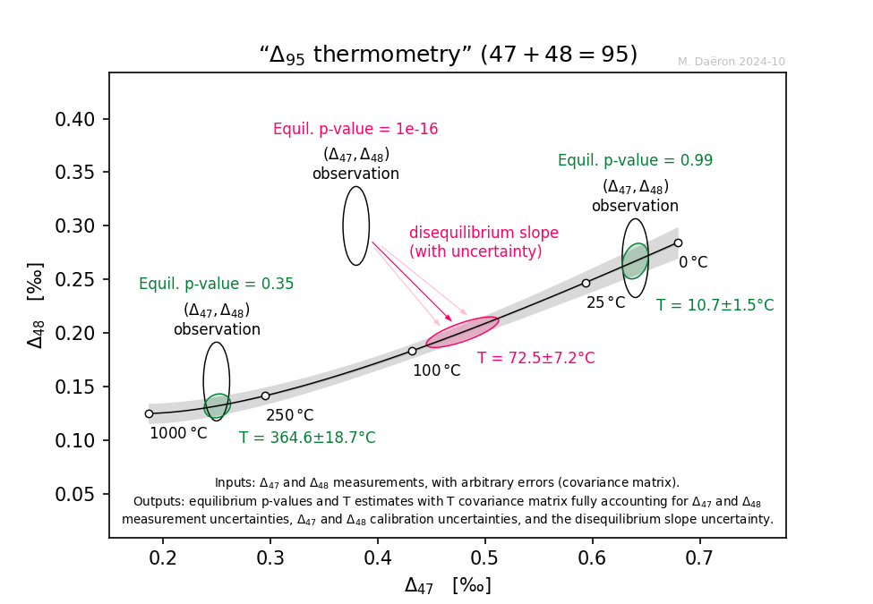

# D95thermo

(because 47 + 48 = 95)

Estimate carbonate formation temperatures from dual clumped isotope measurements, either by direct intersection with the eauilibrium curve or by projection on the equilibrium curve following an aribitrary kinetic fractionation slope.

Returns p-values and (statistically correlated) temperature estimates with full error propagation accounting for:

+ Arbitrarily correlated analytical errors in Δ47 and Δ48 measurements
+ Arbitrarily correlated calibration errors on equilibrium Δ47 and Δ48 laws
+ Uncertainty in the kinetic fractionation slope

